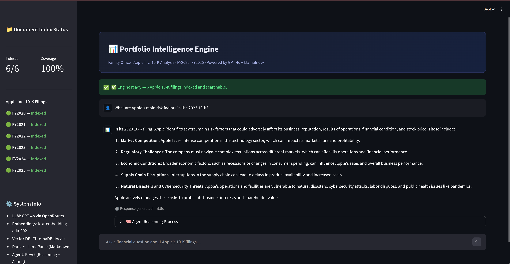

# Timecell Intern Technical Assessment

A collection of wealth management tools that help investors calculate portfolio risks during market crashes, track live asset prices, and receive AI-generated financial advice in simple, everyday language.

---

## Tech Stack (Global)

| Layer | Tools |
|---|---|
| Language | Python 3.10+ |
| Environment | `python-dotenv` for API key management |
| LLM Access | Google Gemini (`google-genai`), OpenRouter (unified API gateway for GPT-4o, GPT-4o-mini) |
| Logging | Python `logging` module (file + stream handlers) |
| Dependency Management | `pip`, `requirements.txt` per task |

> Task-specific libraries are listed under each task.

---

## Tasks Breakdown

---

### Task 1: Portfolio Risk Calculator

**Objective**
Compute key risk metrics from a portfolio dictionary — the same math a wealth manager uses to assess crash survival and runway.

**Description**
`compute_risk_metrics()` iterates over assets, applies crash percentages, and aggregates a severe and moderate scenario side by side. Validation is handled separately in `allocations.py` — portfolios with allocations not summing to 100% or containing negative values are flagged before risk computation runs. A CLI bar chart renders allocation visually using terminal block characters — no external plotting library.

The code is split across four files with single responsibilities:

| File | Responsibility |
|---|---|
| `risk.py` | Core metric computation |
| `allocations.py` | Portfolio structure validation |
| `display.py` | CLI rendering and bar chart |
| `main.py` | Entry point, orchestration |

**Metrics Computed**

| Metric | Description |
|---|---|
| `post_crash_value` | Portfolio value after severe crash |
| `runway_months` | Months of expenses covered post-crash |
| `ruin_test` | `SAFE` / `MODERATE RISK` / `HIGH RISK` based on runway |
| `largest_risk_asset` | Asset with highest `allocation × crash magnitude` |
| `concentration_warning` | `True` if any asset exceeds 40% allocation |
| Moderate scenario | Each asset loses 50% of expected crash — shown alongside severe |

**How to Run**

```bash
cd Task1
python main.py
```

Edit `input.txt` to test different portfolios. The file uses Python dict syntax and supports a `portfolios` list for batch evaluation.

**Output**

```
============================================================
              PORTFOLIO RISK REPORT
============================================================
METRIC                    | SEVERE       | MODERATE
------------------------------------------------------------
Post-Crash Value          | ₹3,50,000.00 | ₹6,75,000.00
Runway                    | 4.37 mo      | 8.43 mo
------------------------------------------------------------
Risk Level              : HIGH RISK
Largest Risk Asset      : BTC
Concentration Warning   : False
Drawdown %              : 65.00%
Safety Ratio            : 0.36

--- Portfolio Allocation ---
BTC        | ████████████                             30.00%
NIFTY50    | ████████████████                         40.00%
GOLD       | ████████                                 20.00%
CASH       | ████                                     10.00%
============================================================
```

---

### Task 2: Live Market Data Fetch

**Objective**
Build a resilient data pipeline that fetches real-time prices for crypto and equity assets in parallel and renders a clean terminal table.

**Description**
The script accepts user input at runtime — asset name and type (`crypto` / `stock`). Fetches run in parallel via `ThreadPoolExecutor`. Each fetch has retry logic (3 attempts with timeout). If a fetch fails, the error is logged and the table still renders with `N/A` for that asset — no crash.

**Tech Stack**

| Library | Purpose |
|---|---|
| `yfinance` | Stock/index price fetching |
| `requests` | CoinGecko API for crypto prices |
| `tabulate` | Terminal table rendering |
| `concurrent.futures` | Parallel fetch execution |

**How to Run**

```bash
cd Task2
pip install yfinance requests tabulate
python task2.py
```

Enter assets interactively. Type `done` to finish and trigger the fetch.

**Output**

```
Asset Prices — fetched at 2025-06-01 10:32:15 IST

+---------+--------------+----------+
| Asset   |        Price | Currency |
+=========+==============+==========+
| BTC     |   62,341.20  | USD      |
| ^NSEI   |   22,541.80  | INR      |
| ETH     |    3,120.45  | USD      |
+---------+--------------+----------+
```

---

### Task 3: AI-Powered Portfolio Explainer

**Objective**
Use LLMs to generate a structured, plain-English risk explanation of any portfolio — in the voice of a financial advisor — with a configurable tone and a critic layer that checks the output.

**Description**

Two LLM calls. One generates. One critiques.

**Junior Advisor (Gemini 2.5 Flash)** — receives the portfolio and a tone-adjusted prompt structured with XML-style tags (`CLIENT_PROFILE`, `PORTFOLIO_DATA`, `OUTPUT_REQUIREMENTS`). Returns a strict JSON object.

**Senior Critic (GPT-4o-mini via OpenRouter)** — receives the junior's output and the original portfolio. Returns a 2-sentence critique with a conviction score.

Tone is configurable via `--tone beginner | experienced | expert`. The prompt instructions shift in complexity while the output schema stays fixed.

**Prompt Engineering Approach**

The prompt uses XML-style delimiters to cleanly separate instructions from data. The output schema is specified inline with an exact JSON template. Setting `response_mime_type="application/json"` on the Gemini call enforces structured output without post-processing regex.

**Tech Stack**

| Library | Purpose |
|---|---|
| `google-genai` | Gemini 2.5 Flash — junior advisor |
| `openai` | OpenRouter-compatible client — senior critic |
| `python-dotenv` | API key loading |
| `argparse` | CLI flags for `--file` and `--tone` |

**How to Run**

```bash
cd Task3
pip install google-genai openai python-dotenv

# Set keys in .env
echo "GEMINI_API_KEY=your_key" >> .env
echo "OPENROUTER_API_KEY=your_key" >> .env

python main.py --file data/sample_portfolio.json --tone beginner
```

**Output**

```
==================================================
EXTRACTED STRUCTURED OUTPUT (BEGINNER TONE):
==================================================
[SUMMARY]
Your portfolio carries significant risk...

[DOING_WELL]
You hold 10% in cash, which provides a liquidity buffer...

[NEEDS_CHANGE]
BTC at 30% is highly volatile. A crash could eliminate...

[VERDICT]
Aggressive

==================================================
SENIOR OFFICER CRITIQUE (OpenAI):
==================================================
The 'Aggressive' verdict is accurate given the 30% BTC allocation...
Conviction Score: 72%
```

---

### Task 4: The Open Problem — Apple 10-K Intelligence Engine

**Objective**
Build a RAG-based financial intelligence system that lets a family office principal query Apple's annual filings (FY2020–FY2025) with sourced, mathematically verified answers.

**Motivation**
Timecell is built around one principle: every conclusion must be traceable. Numbers computed in code, not guessed by a language model. This task operationalises that principle — a ReAct agent that can reason over 5 years of 10-K filings while being architecturally forbidden from doing mental math.

**Description**

The pipeline has three stages:

**Stage 1 — Parse** (`parse.py`)
LlamaParse converts PDFs to structured Markdown, preserving financial tables and footnotes. Output is cached to `data/parsed_docs.json` so parsing runs once.

**Stage 2 — Ingest** (`ingest.py`)
Documents are chunked in two passes — first by Markdown structure (`MarkdownNodeParser`), then by sentence (`SentenceSplitter`, 1024 tokens, 128 overlap). Chunks are embedded (`text-embedding-ada-002`) and stored in a local ChromaDB vector store.

**Stage 3 — Query** (`engine.py`)
A ReAct agent reasons over the index using two tools:

| Tool | Purpose |
|---|---|
| `AppleFilingsSearch` | Semantic retrieval over ChromaDB (top-8 chunks, tree summarise) |
| `Calculator` | Sandboxed `eval` for arithmetic — CAGR, margins, % change |

The system prompt explicitly forbids mental arithmetic. If the agent outputs a computed number without calling the Calculator tool, it fails the integrity check. This is the same guarantee Timecell makes: math is computed in code.

A **critic layer** runs after every agent response — a second LLM call that identifies missing context, surfaces the critical assumption, and assigns a conviction score.

**Interfaces**

| Interface | File | Description |
|---|---|---|
| CLI | `cli.py` | Interactive terminal chat |
| Dashboard | `app.py` | Streamlit UI with agent reasoning steps, source citations, and filing index status |

**Tech Stack**

| Library | Purpose |
|---|---|
| `llama-parse` | PDF → Markdown with table preservation |
| `llama-index-core` | RAG orchestration, ReAct agent |
| `chromadb` | Local persistent vector store |
| `llama-index-vector-stores-chroma` | ChromaDB integration |
| `llama-index-llms-openrouter` | LLM via OpenRouter |
| `llama-index-embeddings-openai` | Embedding model |
| `streamlit` | Web dashboard |
| `python-dotenv` | Environment variable management |

**How to Run**

```bash
cd Task4
pip install -r requirements.txt

# Set keys in .env
LLAMA_CLOUD_API_KEY=your_key
OPENROUTER_API_KEY=your_key
OPENROUTER_BASE_URL=https://openrouter.ai/api/v1

# Step 1: Parse PDFs (run once)
python parse.py

# Step 2: Ingest into ChromaDB (run once)
python ingest.py

# Step 3a: CLI
python cli.py

# Step 3b: Streamlit Dashboard
streamlit run app.py
```

Place Apple 10-K PDFs named `2020.pdf` through `2025.pdf` in the `data/` directory before running `parse.py`.

**Output**

CLI and dashboard both return:
- Structured answer with Markdown tables
- Agent reasoning steps (Thought → Action → Observation)
- Source citations with fiscal year, page number, and relevance score
- Critic's scrutiny with conviction percentage



---

## Key Challenges

**Local LLMs vs. API**
Attempted local inference (Ollama, 7B models) to avoid credit costs. A standard laptop cannot sustain simultaneous embedding generation and vector search alongside a local LLM — memory pressure causes degradation. Switched to API-based inference and focused on prompt precision to minimise unnecessary calls.

**Hallucination in Financial Contexts**
LLMs confidently produce wrong numbers. The fix in Task 4 is architectural — remove the ability. The Calculator tool enforces a hard boundary: the agent cannot output a computed figure without calling the tool first. Prompt-level enforcement alone is insufficient; structure-level enforcement is required.

**Prompt Efficiency**
Every malformed prompt burns API credits. Task 3 required several iterations: moving from unstructured prose prompts to XML-delimited structured prompts with inline JSON schemas reduced output parsing failures to near zero.

**Dependency Conflicts**
LlamaIndex, ChromaDB, and Pydantic have overlapping version constraints that break silently. Required careful pinning and iterative resolution — `llama-index-core`, `llama-index-agent-openai`, and `chromadb` each had breaking API changes across minor versions.

---

## Requirements Coverage

| Requirement |  Task  | How Satisfied |
|---|-----|---|
| `compute_risk_metrics()` with all 5 metrics | Task 1 | `risk.py` — fully implemented with moderate scenario bonus |
| Portfolio validation | Task 1 | `allocations.py` — validates sum, negative allocations, structure |
| CLI bar chart | Task 1 | `display.py` — terminal block characters, no external libraries |
| Live price fetch (crypto + equity) | Task 2 | CoinGecko + yfinance, parallel execution |
| Graceful error handling | Task 2 | Per-asset try/catch, logging, `N/A` fallback in table |
| Structured LLM output | Task 3 | JSON schema enforced via `response_mime_type` and inline template |
| Configurable tone | Task 3 | `--tone` CLI flag, tone-adjusted prompt instructions |
| Critic LLM layer | Task 3 | Second call via OpenRouter critiques verdict and advice |
| Traceable financial reasoning | Task 4 | ReAct agent + source citations with FY and page number |
| Deterministic math | Task 4 | Sandboxed Calculator tool, agent forbidden from mental arithmetic |

---

## AI Usage & Attribution

This project was built with AI assistance, aligned with Timecell’s focus on AI-assisted engineering.

- **Kiro** (similar to Claude Code, with access to Claude and other models through free token usage) was used heavily for Task 4 to structure the RAG pipeline, manage dependencies, and coordinate multi-file workflows.
- **Gemini 3 Pro** was the primary coding assistant for Tasks 1–3, helping with the coding implementation, refactoring, and debugging.
- **Claude** was used to generate the README markdown and improve parts of the interface.
- **ChatGPT** and **Gemini Thinking** were mainly used for documentation, concept clarification, and understanding topics like financial risk metrics and agentic RAG design.

---

## Learnings

Running LLMs locally demands too much memory. A 7B model with embeddings and a vector store quickly exceeds laptop capacity. API-based inference is more practical, and every call costs something, so I learnt to  write better prompts out of necessity.

RAG quality depends entirely on chunking strategy. Naive text splitting breaks financial tables mid-row, making retrieved context useless. A two-pass approach — Markdown structure first, then sentence splitting — preserves tables and significantly improves accuracy, which would be my next task to complete.

Finance math must be exact. Formulas like crash survival, runway, and drawdown are straightforward, but the logic governing severe vs. moderate scenarios and ruin test thresholds requires careful thinking. LLMs will fabricate numbers if given the chance. The fix is architectural: force a sandboxed calculator for every computation rather than hoping the model gets it right.

Prompt structure matters more than prompt content. XML-delimited prompts with inline JSON schemas cut parsing failures to near zero because the model knows exactly what to return. 

---

## Future Work

Implement a query table pipeline to extract and index financial tables separately. Embedding-based retrieval struggles with complex tables containing cross-references and multi-row calculations. Dedicated table detection during ingestion would enable precise retrieval for numerical comparisons and multi-period trends.

As the dataset grows, scalability becomes critical. Move to a distributed vector database with caching for frequently accessed chunks. Batch API calls and cache responses to reduce costs while maintaining accuracy.

We can also consider a domain-specific knowledge graph of financial metrics, their dependencies, and valid value ranges. This would validate retrieved context before calculations and catch inconsistencies that raw embeddings won't detect.
